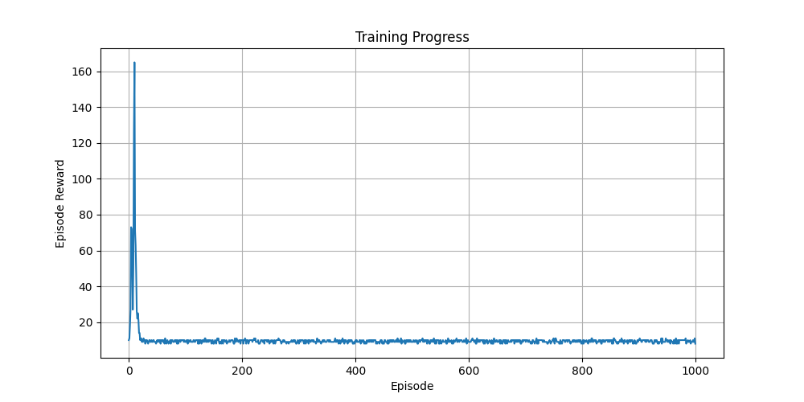

## Q Learning

Episode: 100, Avg Reward: 24.19, Avg Steps: 24.19, Epsilon: 0.606
Episode: 200, Avg Reward: 22.11, Avg Steps: 22.11, Epsilon: 0.367
Episode: 300, Avg Reward: 21.89, Avg Steps: 21.89, Epsilon: 0.222
Episode: 400, Avg Reward: 20.81, Avg Steps: 20.81, Epsilon: 0.135
Episode: 500, Avg Reward: 23.08, Avg Steps: 23.08, Epsilon: 0.082
Episode: 600, Avg Reward: 26.26, Avg Steps: 26.26, Epsilon: 0.049
Episode: 700, Avg Reward: 29.27, Avg Steps: 29.27, Epsilon: 0.030
Episode: 800, Avg Reward: 28.64, Avg Steps: 28.64, Epsilon: 0.018
Episode: 900, Avg Reward: 28.78, Avg Steps: 28.78, Epsilon: 0.011
Episode: 1000, Avg Reward: 29.41, Avg Steps: 29.41, Epsilon: 0.010

Evaluation Results:
Average Reward: 28.90
Average Steps: 28.90

## REINFORCE

Episode 100, Average Reward: 67.66
Episode 200, Average Reward: 46.37
Episode 300, Average Reward: 43.93
Episode 400, Average Reward: 163.67
Episode 500, Average Reward: 9.23
Episode 600, Average Reward: 9.27
Episode 700, Average Reward: 9.45
Episode 800, Average Reward: 9.29
Episode 900, Average Reward: 9.47
Episode 1000, Average Reward: 9.44

Evaluation over 10 episodes: 9.50

